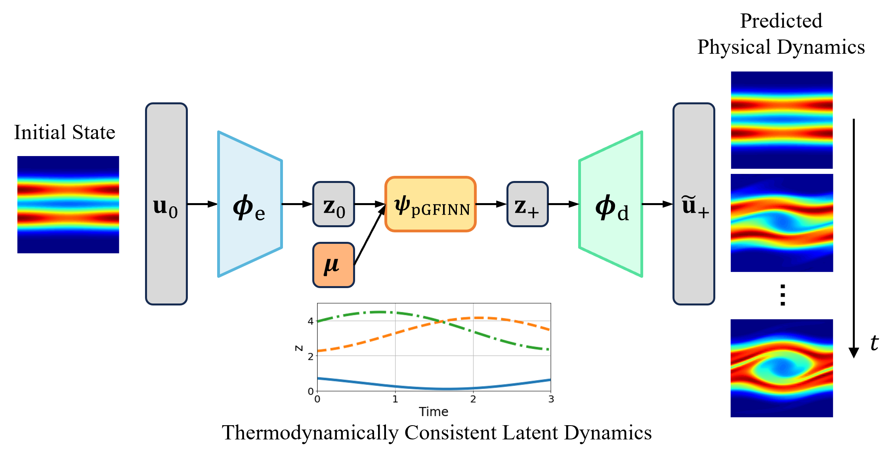

## Thermodynamically Consistent Latent Dynamics Identification for Parametric Systems

<p align="center">
  
</p>

## Requirements

To install requirements:

```setup
conda env create -f environment.yml -n tlasdi-env
```

## Examples

Two examples are provided
- 1D Burgers’ equation (1DBG)
- 1D/1V Vlasov-Poisson equation (vlasov)

All examples data is available [here](https://drive.google.com/drive/folders/1BIoguYU40U-tuygZ5IiDJxPTeOddHp4s?usp=drive_link).

## Training
Run the following command the train a model. The training scripts are pre-configured with the hyperparameters and settings used to generate experimental results. Further details on training settings are provided in the paper.

- 1D Burgers’ equation
  
```train
python train_model_1DBG.py
```

- 1D/1V Vlasov-Poisson equation
  
```train
python train_model_vlasov.py
```

## Evaluation
To evaluate the trained model, modify the result folder path in the testing scripts and run the following command.

- 1D Burgers’ equation

```eval
python test_model_1DBG.py
```

- 1D/1V Vlasov-Poisson equation

```eval
python test_model_vlasov.py
```

## Description of Arguments

- Autoencoder Architecture
  
| Argument | Description | Choices |
| -------- | -------- | -------- |
| `--latent_dim`      | `int`, latent space dimension | Default: `5` |
| `--AE_activation`   | `str`, activation function for autoencoder   |  `tanh`, `relu`, `linear`, `sin`, `gelu`, `elu`, `silu` |

- pGFINN Architecture

| Argument | Description | Choices |
| -------- | -------- | -------- |
| `--param_dim`  | `int`, dimension of parameterization |  Default: `2` | 
| `--pgfinn_activation` | `str`, activation function for pGFINN  | `tanh`, `relu`, `linear`, `sin`, `gelu`, `elu`, `silu`  |
| `--layers` | `int`, number of layers for pGFINN   | Default: `5` |
| `--width` | `int`, width of pGFINN | Default: `40` |
| `--extraD_L` | `int`, # of skew-symmetric matrices generated to construct L | Default: `9` |
| `--extraD_M` | `int`, # of skew-symmetric matrices generated to construct M | Default: `9` |
| `--xi_scale` | `float`, initialization scale of skew-symmetric matrices of pGFINN | Default: `0.3333` |
| `--order` | `int`, time integrator for pGFINN, 1:Euler, 2:RK23, 4:RK45 | `1`, `2`, `4`|

- Training Parameters
  
| Argument | Description | Choices |
| -------- | -------- | -------- |
|`--batch_size`| `int`, batch size | Default: `50`|
|`--load_model`| `str2bool`, load previously trained model | Default: `False`|
|`--epochs`| `int`, number of training epochs | Default: `10000`|
|`--load_epochs`| `int`, number of epochs for loaded networks | Default:`0` |
|`--lambda_r_AE`| `float`, weight for Reconstruction loss | Default: `1e-1`|
|`--lambda_jac_AE`|`float`, weight for Jacobian loss | Default: `1e-9`|
|`--lambda_dx` | `float`, weight for physical dynamics consistency of Model loss | Default: `1e-7`|
|`--lambda_dz` | `float`, weight for latent dynamics consistency of Model loss | Default: `1e-7`|
|`--trunc_period` | `int`, truncation indices for Jacobian computations; only consider every 'trunc_period'th index for computing Jacobian | Default: `1`|
|`--lr` | `float`, initial learning rate | Default: `1e-4`|
|`--miles_lr` | `int`, learning rate decay frequency | Default: `2000`|
|`--gamma_lr` | `float`, rate of learning rate decay | Default: `.99`|
|`--weight_decay_GFINNs` | `float`, weight decay rate for pGFINN | Default: `0`|
|`--weight_decay_AE` | `float`, weight decay rate for AE | Default: `0`|
|`--update_epochs` | `int`, greedy sampling frequency | Default: `1000000`| 
|`--n_train_max` | `int`, max number of training samples for adaptive sampling | Default: `10`| 